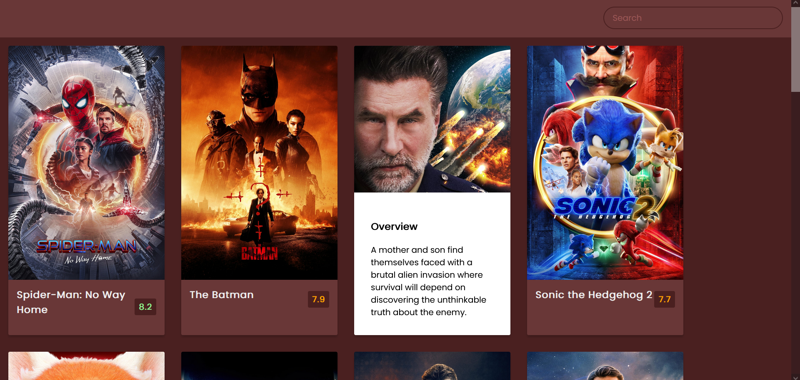
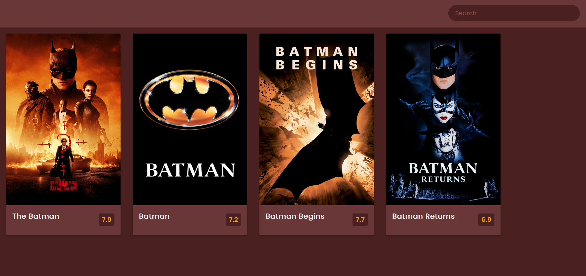
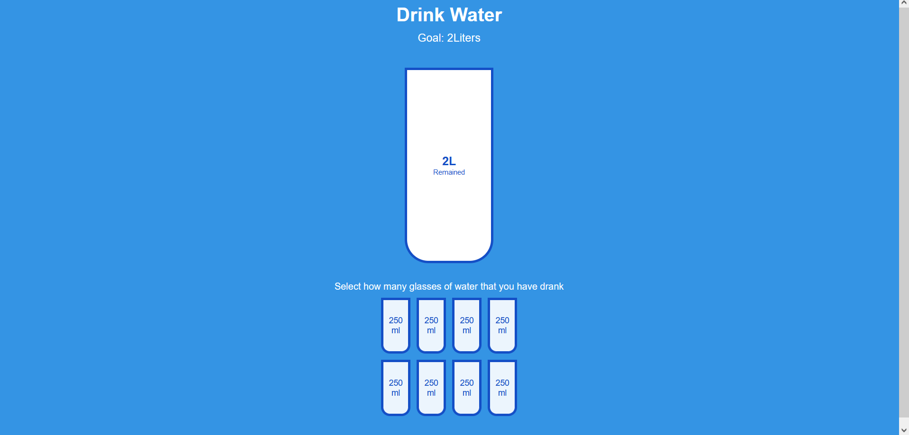
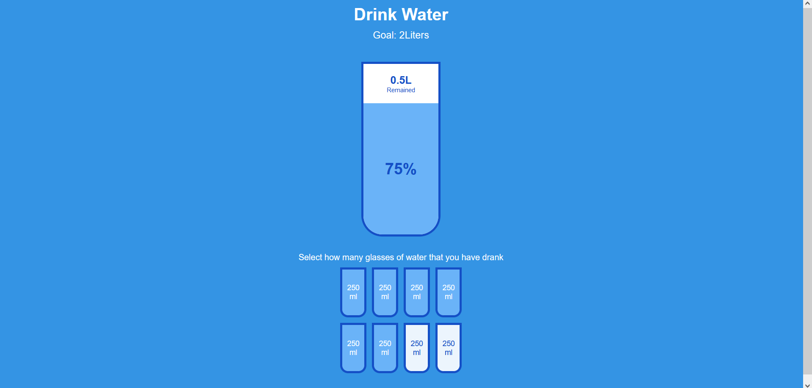
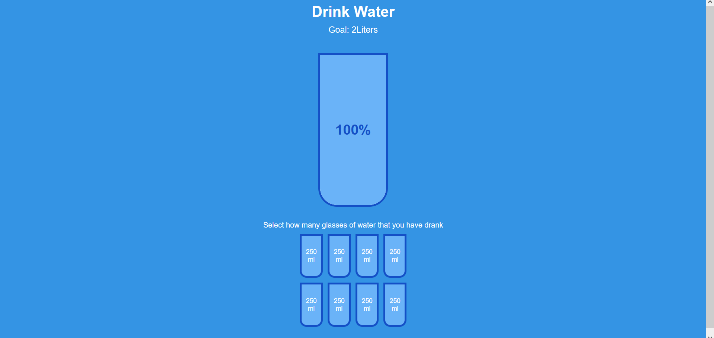
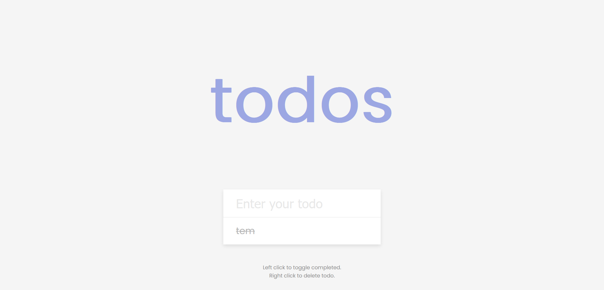
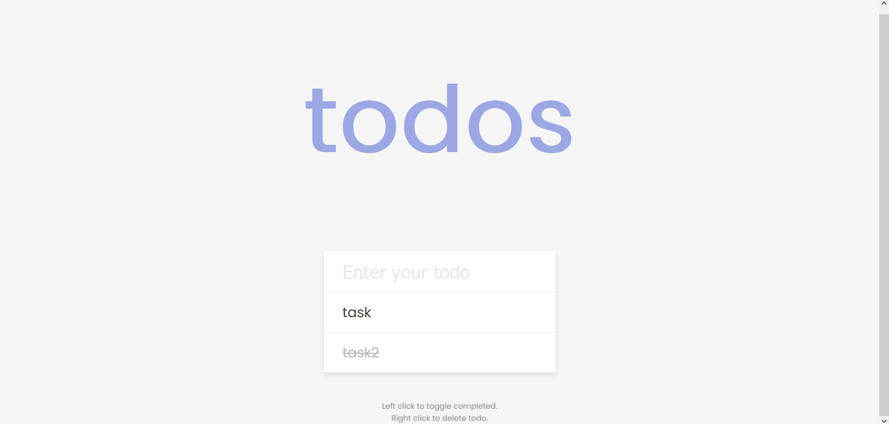

# Movies
Using external api to fetch movies data and display effects. User can search for movies interesting to him
 

# Cups
Using JS and CSS with HTML to create animation about filling the cups
 

# Todo List
List where user writes their Todo chores
 

